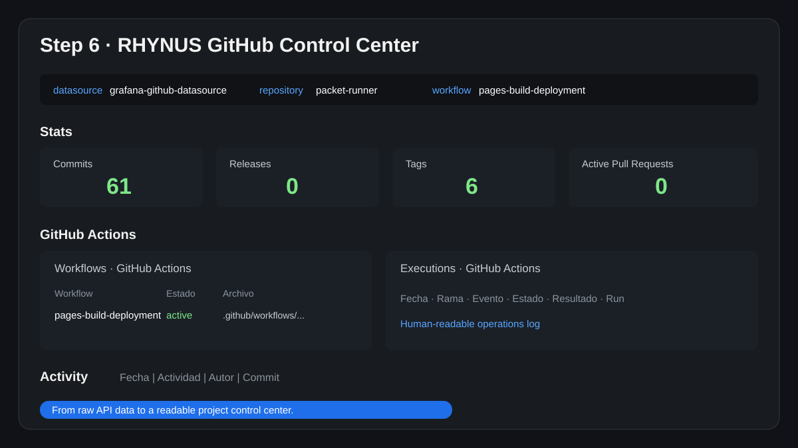

# Grafana GitHub Control Center

Proyecto práctico para montar desde cero un dashboard local de **Grafana + GitHub** y convertir la actividad de los repositorios en una **bitácora humana de commits, pull requests, issues y GitHub Actions**.

## Qué incluye

- guía paso a paso en español;
- dashboard JSON listo para importar en Grafana;
- capturas y gráficos del proceso;
- notas de seguridad sobre tokens de solo lectura;
- troubleshooting de instalación, permisos y conexión.

## Contenido del repositorio

- [`docs/desde-cero-grafana-github-dashboard.md`](docs/desde-cero-grafana-github-dashboard.md) — manual completo.
- [`dashboards/RHYNUS-GitHub-Control-Center-grafana-v3.1.json`](dashboards/RHYNUS-GitHub-Control-Center-grafana-v3.1.json) — versión actual del dashboard.
- [`assets/`](assets/) — material visual preparado para el tutorial.

## Vista rápida

## Objetivo

Este proyecto muestra cómo:

1. instalar Grafana en Linux Mint / Ubuntu;
2. instalar y validar el plugin oficial `grafana-github-datasource`;
3. crear un fine-grained personal access token de GitHub con mínimo privilegio;
4. conectar GitHub con Grafana;
5. importar el dashboard `GitHub Default`;
6. personalizarlo hasta llegar a un panel propio tipo **RHYNUS · GitHub Control Center**.

## Seguridad

- No publiques tu token de GitHub.
- Usa permisos **read-only** siempre que sea posible.
- Limita el token a los repositorios necesarios.
- Añade expiración y rótalo periódicamente.

## Créditos

Documentación y guía preparadas durante una instalación real y reproducible.

---

Si quieres publicar tu propia variante, puedes usar este repositorio como base y adaptar el dashboard a tus proyectos.
